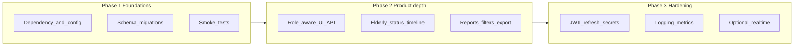

# Elderly Assistance Platform — upgrade roadmap

## Current baseline (from repo)

- **Backend:** Spring Boot **3.2.4**, Java **17**, JWT, MySQL, JPA `ddl-auto` driven schema, [`SecurityConfig.java`](Backend-Projet-Elderly-Assistance-Platform/src/main/java/tn/beecoders/elderly/config/SecurityConfig.java) with role-based HTTP rules.
- **Frontend:** Angular **17** + Angular Material, Tailwind (preflight off), proxy to API, [`app.config.ts`](Frontend-Projet-Elderly-Assistance-Platform/src/app/app.config.ts) + standalone components.
- **Product surface:** Users (incl. last-admin guard), elderly + caregiver assignment, alerts (type + priority + resolve), dashboard stats, summary reports; roles include `ELDERLY` / `FAMILY_MEMBER` in domain with UI/route alignment still uneven vs `ADMIN` / `CAREGIVER`.

---

## Strategic goals

1. **Demo credibility:** Clear care narrative (who sees what, triage, history), stable UX, no “student CRUD” gaps.
2. **Production readiness:** Reproducible schema, secrets and auth hygiene, observability, and automated regression tests.
3. **Maintainability:** One API versioning story, documented contracts, and dependency cadence (LTS Angular / supported Boot line).

---

## Phase 1 — Foundations (highest ROI, low risk)

**1.1 Dependency and runtime alignment**

- **Angular:** Plan upgrade to current **LTS** within the v17→v18+ line your team accepts (run `ng update`, fix breaking changes in Material and standalone APIs). Goal: security patches and CLI stability.
- **Spring Boot:** Move to latest **3.3.x** (or 3.4.x when validated) on the same Java 17 baseline first; evaluate **Java 21** as a separate step (build + CI + hosting).
- **Align API prefix strategy:** Today auth is under [`/api/v1/auth/**`](Backend-Projet-Elderly-Assistance-Platform/src/main/java/tn/beecoders/elderly/config/SecurityConfig.java) while the rest is `/api/...`. Either document this permanently or gradually introduce `/api/v1/...` for resource APIs behind a compatibility window (proxy + Angular base URL), avoiding a big-bang rename.

**1.2 Database and configuration**

- Introduce **Flyway** (or Liquibase) with an initial baseline migration matching production tables (users, elderly_persons, alerts, etc.). **Stop relying on `ddl-auto: update` alone** for anything beyond local dev; keep `validate` or `none` in staging/prod.
- Externalize secrets: **JWT secret** must not live in committed [`application.yml`](Backend-Projet-Elderly-Assistance-Platform/src/main/resources/application.yml); use env vars / Spring Cloud Config–style pattern for deployment.

**1.3 Automated tests (minimum viable)**

- **Backend:** 5–10 focused `@SpringBootTest` + `@AutoConfigureMockMvc` tests: login, `GET /api/dashboard/stats` scoped by role, `POST /api/alerts` permission denied/success, last-admin delete returns 400.
- **Frontend:** 2–4 **component or shallow integration** tests (dashboard load + error path, users save error shows snackbar) or one **Playwright** smoke (login → dashboard visible).

---

## Phase 2 — Product upgrades (business value)

**2.1 Role-aware experience (backend already has four roles)**

- **Route and menu matrix:** Define what `ELDERLY` and `FAMILY_MEMBER` may see (read-only profile + linked elderly + alerts?) vs caregiver vs admin; implement with [`role.guard.ts`](Frontend-Projet-Elderly-Assistance-Platform/src/app/core/guards/role.guard.ts) + sidebar visibility, and mirror rules in Spring Security on sensitive endpoints (reports, user admin, caregiver assignment).
- **Optional:** “Act as” or scoped endpoints for family members only for **linked** `ElderlyPerson` (already modeled on `User`).

**2.2 Elderly care signal**

- Add **care status** on [`ElderlyPerson`](Backend-Projet-Elderly-Assistance-Platform/src/main/java/tn/beecoders/elderly/domain/ElderlyPerson.java) (`STABLE` / `WARNING` / `CRITICAL`) with admin/caregiver update API and dashboard/report aggregates. Complements existing **alert priority** on [`Alert`](Backend-Projet-Elderly-Assistance-Platform/src/main/java/tn/beecoders/elderly/domain/Alert.java).

**2.3 Alerts and history**

- **Paginated** `GET` alerts (and optional `GET /api/elderly-persons/{id}/alerts`) with filters: `resolved`, `priority`, date range.
- Store **resolvedAt** / **resolvedBy** (user id) on alert for accountability (small schema change + DTO).

**2.4 Reporting**

- Extend [`ReportController`](Backend-Projet-Elderly-Assistance-Platform/src/main/java/tn/beecoders/elderly/controller/ReportController.java) with **query params** (`from`, `to`, optional `caregiverId` for admin) returning the same JSON shape plus series for charts; frontend charts (e.g. ng2-charts or lightweight SVG) on [`reports.component.ts`](Frontend-Projet-Elderly-Assistance-Platform/src/app/features/reports/reports.component.ts).
- **CSV export** first (simple, demo-friendly); PDF later if required.

---

## Phase 3 — Security and platform hardening

**3.1 JWT lifecycle**

- **Refresh tokens** (httpOnly cookie or rotated refresh JWT) and shorter access-token TTL; document logout invalidation strategy (server-side blocklist optional, scope only if required).

**3.2 API hardening**

- Rate limit **auth** endpoints (Bucket4j / Spring Cloud Gateway / reverse proxy).
- Consistent **problem+json** or stable error body (you already have [`GlobalExceptionHandler`](Backend-Projet-Elderly-Assistance-Platform/src/main/java/tn/beecoders/elderly/exception/GlobalExceptionHandler.java)); add **401 vs 403** clarity for front-end handling.

**3.3 Observability**

- Structured logging (request id, user email hash), health indicators (`/actuator/health` with security), optional **Micrometer** metrics for alert creation rate and login failures.

**3.4 Optional “wow” (defer until Phase 1–2 stable)**

- **SSE** or **WebSocket** channel for new alerts to dashboard (small scope: notify + refetch).
- **Audit log** table for admin actions (user delete, role change, caregiver assign).

---

## What to avoid (scope control)

- Rewriting to microservices or event sourcing for this codebase size.
- Replacing JWT with OAuth2/OIDC **unless** a deployment requirement appears (document as future integration).
- Big-bang UI framework change; stay on Angular Material + Tailwind patterns already in use.

---

## Suggested acceptance order

| Order | Deliverable | Acceptance criteria |
|-------|-------------|---------------------|
| 1 | Flyway baseline + prod `ddl-auto` policy | Clean migrate on empty DB; CI runs migrations |
| 2 | Backend integration tests (core flows) | CI green; cover auth + RBAC + alerts |
| 3 | Angular LTS upgrade | `ng build`, manual smoke login/dashboard |
| 4 | Elderly status + alert resolved metadata | API + UI visible on elderly detail / list |
| 5 | Reports date range + CSV | Admin can export; caregiver scoped |
| 6 | JWT refresh + env-based secrets | No secrets in git; token refresh documented |

---

## Files likely touched in early execution

- Backend: [`pom.xml`](Backend-Projet-Elderly-Assistance-Platform/pom.xml), [`application.yml`](Backend-Projet-Elderly-Assistance-Platform/src/main/resources/application.yml), new `db/migration/*`, controllers/services for reports/alerts/elderly.
- Frontend: [`package.json`](Frontend-Projet-Elderly-Assistance-Platform/package.json), [`proxy.conf.json`](Frontend-Projet-Elderly-Assistance-Platform/src/proxy.conf.json), guards/sidebar, dashboard and reports features.

This plan is intentionally **phased** so you can stop after Phase 1 for a stronger academic/demo baseline, or continue through Phase 3 for a production-shaped system.
