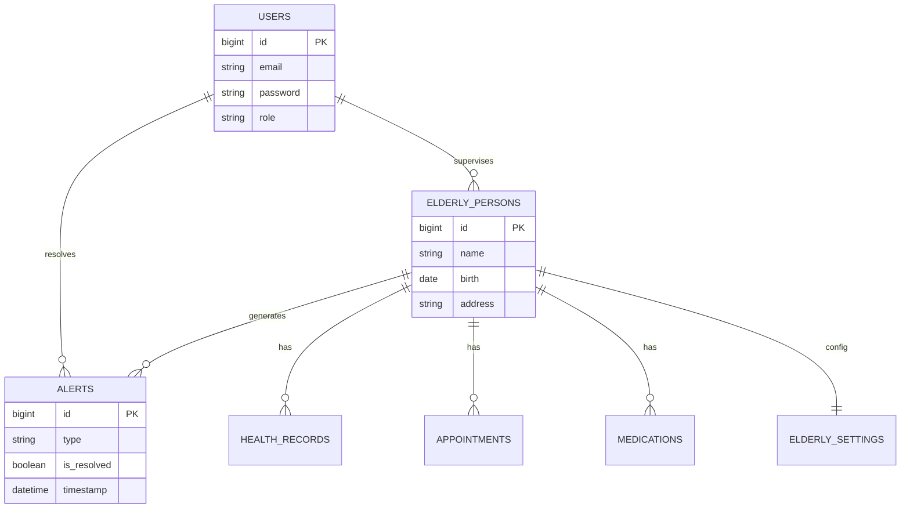
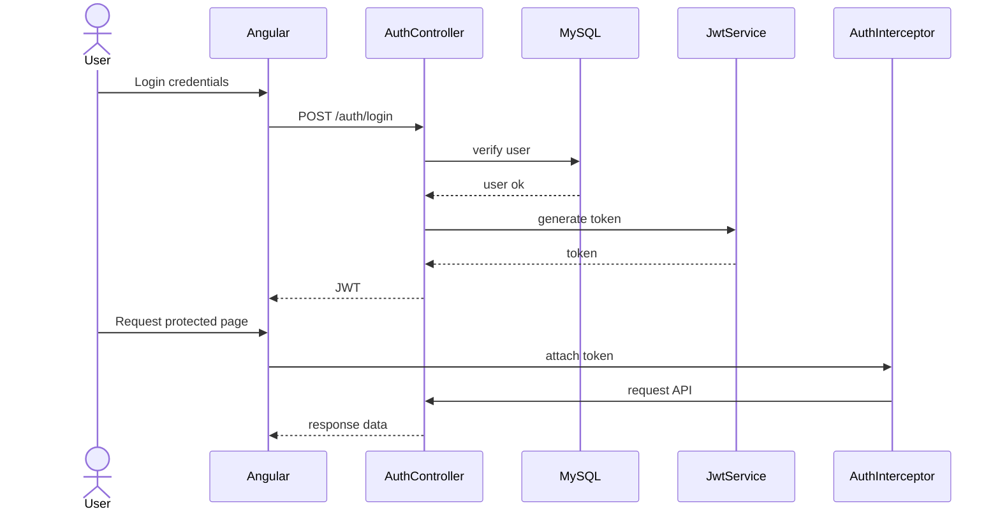

# UML Diagrams - Elderly Assistance Platform

This document outlines the architectural blueprints of the system, upgraded to align with the final Senior Implementation including Clean Architecture, Spring Security JWT paradigms, and Interceptor-driven security patterns.

## 1. Use Case Diagram

```mermaid
usecaseDiagram
actor "Personne Âgée" as elderly
actor "Famille" as family
actor "Soignant (Caregiver)" as caregiver
actor "Administrateur (Admin)" as admin

package "Plateforme d’assistance aux personnes âgées" {

    usecase "S'authentifier (JWT)" as UC1
    usecase "Déclencher une alerte (SOS / chute / geofencing)" as UC2
    usecase "Consulter les alertes" as UC3
    usecase "Résoudre une alerte" as UC4
    usecase "Gérer traitements médicaux" as UC5
    usecase "Consulter timeline patient" as UC6
    usecase "Gérer utilisateurs" as UC7
}

elderly --> UC1
elderly --> UC2

family --> UC1
family --> UC3
family --> UC6

caregiver --> UC1
caregiver --> UC3
caregiver --> UC4
caregiver --> UC5
caregiver --> UC6

admin --> UC1
admin --> UC7
```

## 2. Entity-Relationship (ER) Diagram (aligned with JPA entities)

This reflects the **current** persistence model in the Spring Boot module including the HealthTech enhancements.



## 3. Sequence Diagram : Full Authentication & Route Guard Flow (AuthInterceptor)

This diagram outlines how the Angular Frontend correctly negotiates with the Spring Boot Backend using JSON Web Tokens.



## 4. Component Diagram (HealthTech layering)

```mermaid
componentDiagram

package "Frontend Angular" {
    [UI Components]
    [AuthInterceptor]
    [AuthGuard]
    [WebSocketService]
}

package "Backend Spring Boot" {
    [Controllers]
    [Security Filter JWT]
    [Services]
    [Repositories]
    [WebSocket Broker]
}

database "MySQL" {
    [Database]
}

[UI Components] --> [Controllers]
[AuthInterceptor] --> [Security Filter JWT]
[Controllers] --> [Services]
[Services] --> [Repositories]
[Repositories] --> [Database]

[WebSocketService] --> [WebSocket Broker]
```

## 5. Deployment Diagram (Dockerized Infrastructure)

```mermaid
deploymentDiagram

node "Docker Host" {

    node "Frontend Container (Nginx)" {
        artifact "Angular Build"
    }

    node "Backend Container (Spring Boot)" {
        artifact "API REST + WebSocket"
    }

    node "Database Container (MySQL)" {
        artifact "Elderly DB"
    }
}

node "Client Browser" as client

client --> "Frontend Container (Nginx)" : HTTP
"Frontend Container (Nginx)" --> "Backend Container (Spring Boot)" : REST / WS
"Backend Container (Spring Boot)" --> "Database Container (MySQL)" : JDBC
```
