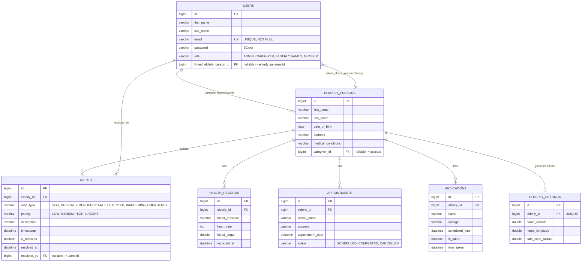
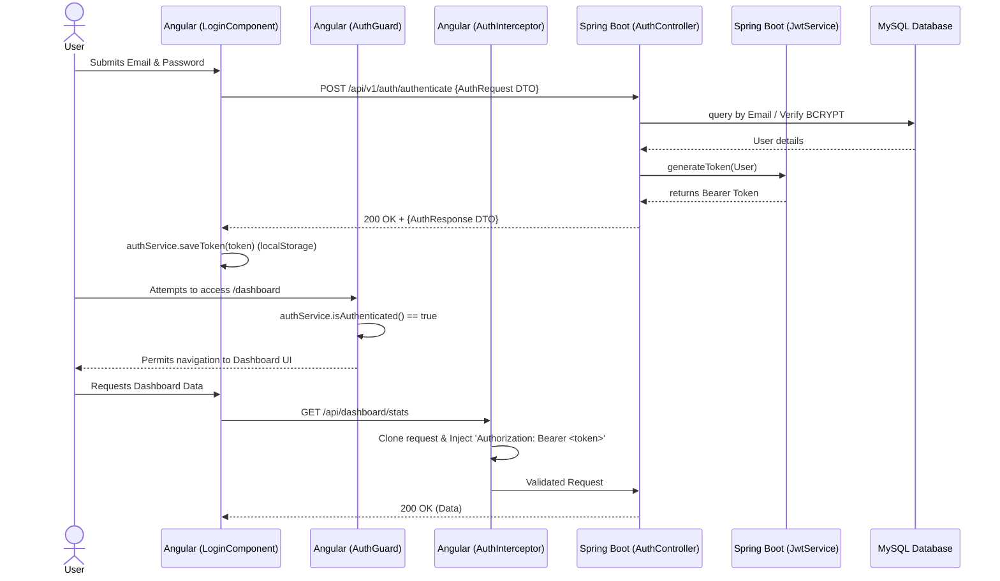

# UML Diagrams - Elderly Assistance Platform

This document outlines the architectural blueprints of the system, upgraded to align with the final Senior Implementation including Clean Architecture, Spring Security JWT paradigms, and Interceptor-driven security patterns.

## 1. Use Case Diagram

```mermaid
usecaseDiagram
    actor "Elderly" as elderly
    actor "Family Member" as family
    actor "Caregiver" as caregiver
    actor "Admin" as admin

    package "Elderly Assistance Platform" {
        usecase "Authenticate (JWT)" as UC1
        usecase "Manage Accounts (CRUD)" as UC2
        usecase "Trigger Emergency Alert" as UC3
        usecase "Acknowledge Alerts" as UC4
        usecase "Manage Medication Schedules" as UC5
        usecase "Monitor Daily Activities" as UC7
    }

    elderly --> UC1
    elderly --> UC3
    
    family --> UC1
    family --> UC4
    family --> UC5
    family --> UC7

    caregiver --> UC1
    caregiver --> UC4
    caregiver --> UC5
    caregiver --> UC7

    family --> UC1
    family --> UC4
    family --> UC5
    family --> UC7

    admin --> UC1
    admin --> UC2
    admin --> UC7
```

## 2. Entity-Relationship (ER) Diagram (aligned with JPA entities)

This reflects the **current** persistence model in the Spring Boot module including the HealthTech enhancements.



## 3. Sequence Diagram : Full Authentication & Route Guard Flow (AuthInterceptor)

This diagram outlines how the Angular Frontend correctly negotiates with the Spring Boot Backend using JSON Web Tokens.



## 4. Component Diagram (HealthTech layering)

```mermaid
componentDiagram
    package "Frontend (Angular 17+)" {
        [AuthInterceptor] --> [AuthGuard] : protects state
        [AuthGuard] --> [UI Components]
        [WebsocketService] --> [UI Components] : Provides live StompJS feed
    }

    package "Backend (Spring Boot 3)" {
        [GlobalExceptionHandler] -.-> [Controllers] : @RestControllerAdvice
        [ChannelInterceptor] --> [WebSocket Broker] : Validates JWT for STOMP
        [WebSocket Broker] --> [WebsocketService] : Push Private Alerts
        [Controllers] --> [DTO records] : map entity to JSON-safe DTO
        [Controllers] --> [Domain services] : LocationService, PdfExportService
        [Domain services] --> [Repositories]
        [Controllers] --> [Repositories] : read queries where no service yet
        [MedicationScheduler] --> [Repositories] : Scans DB every 30min
    }

    [UI Components] --> [Controllers] : HTTP / REST JSON
    [Repositories] --> [MySQL container] : Hibernate JDBC
```

## 5. Deployment Diagram (Dockerized Infrastructure)

```mermaid
deploymentDiagram
    node "Docker Engine Host" {
        node "Nginx Server (Frontend Container)" {
            artifact "Angular 17 Build (Dist)"
        }
        
        node "Alpine JRE (Backend Container)" {
            artifact "Spring Boot JAR"
            artifact "Embedded Tomcat (Port 8080)"
        }
        
        node "MySQL 8.0 (Database Container)" {
            artifact "elderly_assistance_db"
            artifact "Volume: elderly-mysql-data"
        }
    }
    
    "Client Browser" --> "Nginx Server (Frontend Container)" : HTTP :80
    "Nginx Server (Frontend Container)" --> "Alpine JRE (Backend Container)" : REST API
    "Alpine JRE (Backend Container)" --> "MySQL 8.0 (Database Container)" : JDBC :3306 (with Healthchecks)
```
